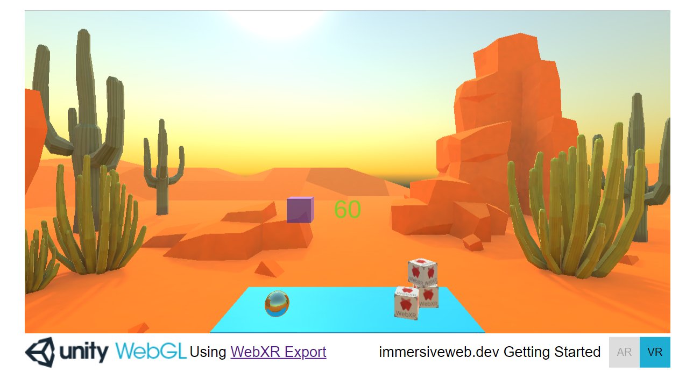

[Unity](https://unity.com/) is a GUI based game engine. It has a number of unofficial WebXR extensions.

# [WebXR Export](https://github.com/De-Panther/unity-webxr-export)
Create a new Unity Project (2019.4.7f1 and up in the 2019.4.x cycle).
Switch platform to WebGL.

Import WebXR Export and WebXR Interactions packages from OpenUPM.
- [WebXR Export](https://openupm.com/packages/com.de-panther.webxr/)
- [WebXR Interactions](https://openupm.com/packages/com.de-panther.webxr-interactions/)

Once packages are imported, Go to `Window > WebXR > Copy WebGLTemplates`.

After `WebGLTemplates` are in the `Assets` folder, Open the `XR Plug-in Management` tab in the `Project Settings` window and select the `WebXR Export` plug-in provider.

Now you can import the `Sample Scene` from `Window > Package Manager > WebXR Interactions > Import into Project`.

In `Project Settings > Player > Resolution and Presentation`, select `WebXR` as the `WebGL Template`.

Now you can build the project.

Make sure to build it from `Build Settings > Build`. Unity's `Build And Run` server use HTTP. Run the build on your own HTTPS server.

That's it.